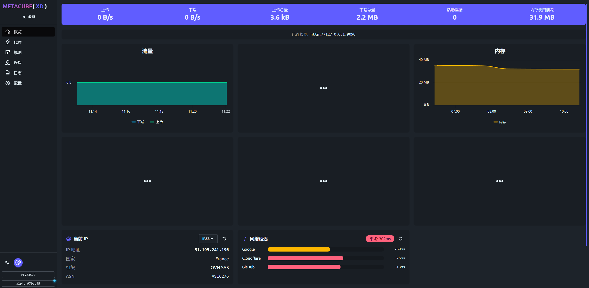
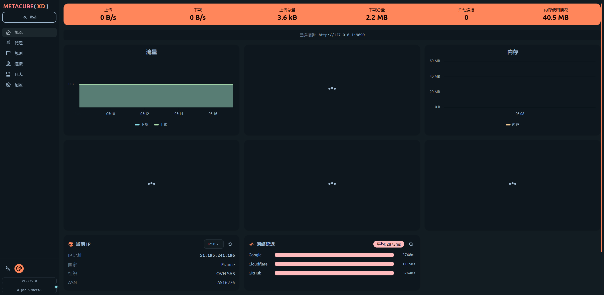

[TOC]

# 关于本项目

**clash-for-linux** 是一个面向 Linux 服务器/桌面环境的 **Clash 自动化运行与管理脚本集**。
项目基于 **Clash Meta / Mihomo 内核**，通过脚本方式实现 **开箱即用、可维护、可回滚** 的代理部署体验，适合用于提升服务器访问 GitHub、Docker Hub 等海外资源的速度。
<p align="center">
  
  
  
</p>

本项目主要解决以下问题：

- ❌ 官方 Clash 二进制下载、架构区分、配置部署繁琐
- ❌ 手动管理 Clash 进程、端口、环境变量不稳定
- ❌ systemd 服务、权限、安全配置缺乏统一方案
- ❌ 多订阅 / 配置混乱，升级和回滚成本高

### 核心特性

- 🚀 **自动识别系统架构**（x86_64 / aarch64 / armv7），下载并使用对应 Clash 内核
- 🧩 **脚本化部署**，无需手动安装依赖，适合服务器与无桌面环境
- 🔧 **systemd 服务管理**，支持 start / stop / restart / enable
- 🗂️ **清晰的目录结构**，配置、日志、二进制、mixin 分离，便于维护与回滚
- 🔐 **安全默认配置**
  - 管理面板默认仅绑定 `127.0.0.1`
  - 自动生成或自定义 Secret
  - 默认开启 TLS 校验
- 🧪 **端口自动检测与分配**，避免冲突
- 🔄 **多订阅管理（clashctl）**，支持订阅切换、更新、日志查看
- 🧠 **Mixin 机制**，可按需追加/覆盖 Clash 配置
- 🌐 **Tun 模式支持**（需 Clash Meta / Premium）

### 适用场景

- Linux 云服务器（VPS）
- 家用 NAS / 小主机（x86 / ARM）
- 需要稳定访问 GitHub、Go / Node / Docker 生态的开发环境
- 不希望长期手动维护 Clash 运行状态的用户

### 项目定位说明

- ✅ 本项目 **不提供任何订阅内容**，仅负责运行与管理
- ✅ 本项目是 **Clash / yacd 的工程化封装**，并非 Clash 的替代品
- ❌ 不适合只想“点点 UI 就用”的纯桌面用户
- ❌ 不包含任何节点、机场或订阅推荐

### 更新状态

📅 **持续维护中**
 最近更新：**2026-01-15**


# 安装

> **推荐路径优先，一键安装即可满足 90% 使用场景。**
>  手动模式适合调试、二次开发或自定义部署。

------

## 🚀 一键安装（推荐）

```
git clone --branch master --depth 1 https://github.com/wnlen/clash-for-linux.git
cd clash-for-linux
sudo bash install.sh
```

安装脚本将自动完成：

- 识别系统架构并下载对应 Clash 内核
- 创建 systemd 服务（默认启用并启动）
- 检测并规避端口冲突
- 安装 `clashctl` 到 `/usr/local/bin`
- 创建低权限运行用户（默认 `clash`）

### [进阶安装与高级用法](docs/install.md)

------

## ⚙️ 配置订阅（必须）

编辑 `.env` 文件，设置订阅地址：

```
sudo bash -c 'echo "CLASH_URL=<订阅地址>" > /opt/clash-for-linux/.env'
```

配置完成后，**重启服务使配置生效**：

```
sudo systemctl restart clash-for-linux.service
```

说明：

- 安装脚本会自动识别并适配 **v2rayN / Base64 订阅**（vmess / vless / ss 等），并生成 `proxy-providers` 配置
- 若使用 **Clash YAML 订阅**，将直接作为配置文件使用，不经过自动转换
- `CLASH_SECRET` 为空时将自动生成
- 端口支持设置为 `auto`，自动检测并分配
- 其它架构可通过 `CLASH_BIN` 指定二进制路径，或命名为 `clash-linux-<arch>`

------

## 🌐 打开 Clash 管理面板（推荐）

出于安全考虑，管理接口默认 **仅监听服务器本机**：

```
127.0.0.1:9090
```

如需在 **本地浏览器** 中访问服务器上的管理面板，
 请使用 SSH 端口转发（本地终端）：

```
ssh -N -L 9090:127.0.0.1:9090 root@<服务器IP>
```

然后在浏览器中访问：

```
http://127.0.0.1:9090/ui
```

> 不建议直接将管理端口暴露到公网。

------

## ▶️ 开启 / 关闭系统代理

**先加载一次环境变量（新终端只需一次）：**

```
source /etc/profile.d/clash-for-linux.sh
```

**开启代理：**

```
proxy_on
```

**关闭代理：**

```
proxy_off
```

## 🧰 常用管理命令

统一管理入口（推荐使用）：

```
clashctl status
clashctl start
clashctl restart
clashctl update
clashctl set-url "https://example.com/your-subscribe"
```

### 多订阅管理

```
clashctl sub add office "https://example.com/office"
clashctl sub add personal "https://example.com/personal"
clashctl sub list
clashctl sub use personal
clashctl sub update
clashctl sub log
```

------

## 🔄 配置修改与更新

### 修改 Clash 配置并重启

```
vim conf/config.yaml
clashctl restart
```

> `restart` 不会更新订阅

### 更新订阅

```
clashctl update
```

或指定订阅：

```
clashctl sub update personal
```

------

## 🧩 Mixin 配置（可选）

用于追加或覆盖 Clash 配置。

- 默认读取：`conf/mixin.d/*.yaml`（按文件名排序）
- 也可在 `.env` 中指定：

```
export CLASH_MIXIN_DIR='conf/mixin.d'
export CLASH_MIXIN_PATHS='conf/mixin.d/base.yaml,conf/mixin.d/rules.yaml'
```

------

## 🌐 Tun 模式（可选）

需 Clash Meta / Premium 支持，在 `.env` 中配置：

```
export CLASH_TUN_ENABLE=true
export CLASH_TUN_STACK=system
export CLASH_TUN_AUTO_ROUTE=true
export CLASH_TUN_AUTO_REDIRECT=false
export CLASH_TUN_STRICT_ROUTE=false
export CLASH_TUN_DNS_HIJACK='any:53'
```

------

## ⛔ 停止服务

```
clashctl stop
proxy_off
```

------

## 🔍 状态检查（可选）

端口：

```
netstat -tln | grep -E '9090|789.'
```

代理环境变量：

```
env | grep -E 'http_proxy|https_proxy'
```

------

## 🧹 卸载

```
sudo bash uninstall.sh
```

------

## 📝 说明

- 管理面板默认绑定 `127.0.0.1:9090`
- 如需对外访问，请自行配置并确保 `CLASH_SECRET` 足够复杂
- 默认启用 TLS 校验，不推荐关闭

<br>

## subconverter 多架构支持

`subconverter` 用于将订阅内容转换为标准 clash 配置。默认会尝试以下位置：

- `tools/subconverter/subconverter`
- `tools/subconverter/subconverter-<arch>`
- `tools/subconverter/bin/subconverter-<arch>`

其中 `<arch>` 取值为：

- `linux-amd64`
- `linux-arm64`
- `linux-armv7`

自动下载默认使用 `https://github.com/tindy2013/subconverter/releases/latest/download/subconverter_{arch}.tar.gz`，
如果需要自定义来源或关闭下载，可以设置：

- `SUBCONVERTER_PATH`：指定自定义 `subconverter` 可执行文件路径。
- `SUBCONVERTER_AUTO_DOWNLOAD=false`：关闭自动下载（默认会尝试自动下载，需 `curl`/`wget`）。
- `SUBCONVERTER_DOWNLOAD_URL_TEMPLATE`：下载模板，使用 `{arch}` 占位符，如：

```bash
export SUBCONVERTER_AUTO_DOWNLOAD=true
export SUBCONVERTER_DOWNLOAD_URL_TEMPLATE='https://example.com/subconverter_{arch}.tar.gz'
```

当 `subconverter` 不可用时会自动跳过转换，并提示警告。


<br>

## Clash Dashboard

- 访问 Clash Dashboard

通过浏览器访问 `start.sh` 执行成功后输出的地址，例如：http://192.168.0.1:9090/ui

- 登录管理界面

在`API Base URL`一栏中输入：http://\<ip\>:9090 ，在`Secret(optional)`一栏中输入启动成功后输出的Secret。

点击Add并选择刚刚输入的管理界面地址，之后便可在浏览器上进行一些配置。

- 更多教程

此 Clash Dashboard 使用的是[yacd](https://github.com/haishanh/yacd)项目，详细使用方法请移步到yacd上查询。


<br>

## 设置代理
1. 开启 IP 转发

```bash
echo "net.ipv4.ip_forward = 1" | sudo tee -a /etc/sysctl.conf
sudo sysctl -p
```

2.配置iptables
```bash
# 先清空旧规则
sudo iptables -t nat -F

# 允许本机访问代理端口
sudo iptables -t nat -A OUTPUT -p tcp --dport 7890 -j RETURN
sudo iptables -t nat -A OUTPUT -p tcp --dport 7891 -j RETURN
sudo iptables -t nat -A OUTPUT -p tcp --dport 7892 -j RETURN

# 让所有 TCP 流量通过 7892 代理
sudo iptables -t nat -A PREROUTING -p tcp -j REDIRECT --to-ports 7892

# 保存规则
sudo iptables-save | sudo tee /etc/iptables.rules
```

3. 让 iptables 规则开机生效
在 `/etc/rc.local`（或 `/etc/rc.d/rc.local`）加上：

```bash
#!/bin/bash
iptables-restore < /etc/iptables.rules
exit 0
```

```bash
sudo chmod +x /etc/rc.local
```


# 常见问题

1. 部分Linux系统默认的 shell `/bin/sh` 被更改为 `dash`，运行脚本会出现报错（报错内容一般会有 `-en [ OK ]`）。建议使用 `bash xxx.sh` 运行脚本。

2. 部分用户在UI界面找不到代理节点，基本上是因为厂商提供的clash配置文件是经过base64编码的，且配置文件格式不符合clash配置标准。

   目前此项目已集成自动识别和转换clash配置文件的功能。如果依然无法使用，则需要通过自建或者第三方平台（不推荐，有泄露风险）对订阅地址转换。
   
3. 程序日志中出现`error: unsupported rule type RULE-SET`报错，解决方法查看官方[WIKI](https://github.com/Dreamacro/clash/wiki/FAQ#error-unsupported-rule-type-rule-set)
## ⭐ Star History

[](https://star-history.com/#wnlen/clash-for-linux&Date)